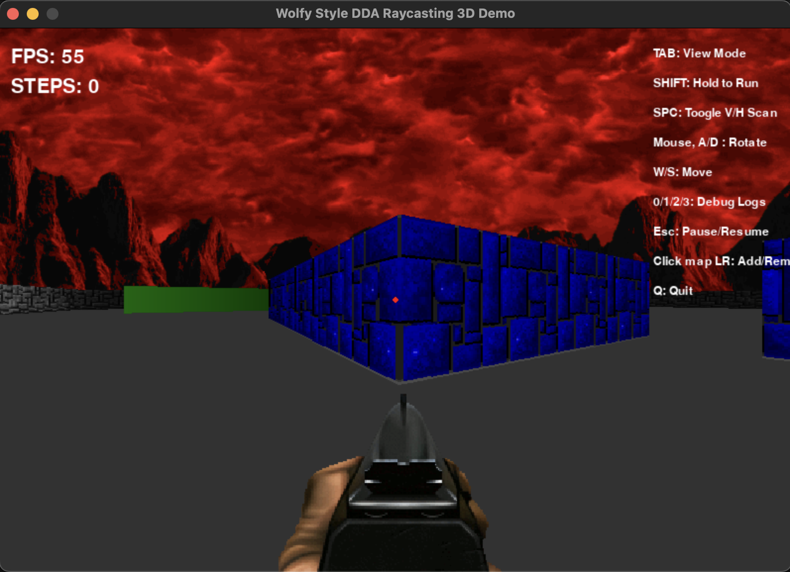
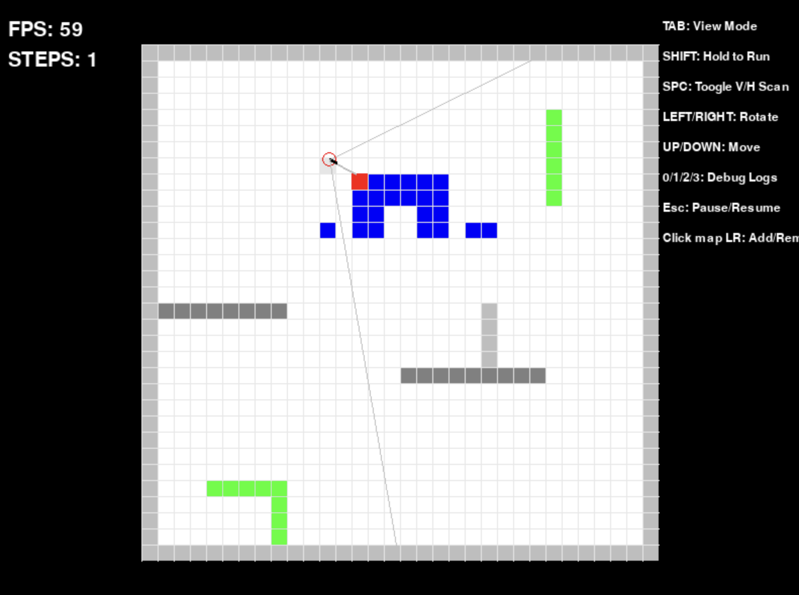

License: MIT

Code: Roy Massaad

# Python 3D DDA Raycaster 

Python retro basic 3d Wolfenstein textured walls raycaster using DDA to optimize/reduce ray casting steps.

# Requirements

* Python 3
* Pygame-ce (actually faster than pygame, still lacking tho in fps in blitting)
* CPU faster than an intel 286 and more than 528k of conventional memory sadly ;(

# Features

* Map/Top 2d view for debbuging and 3d view
* Map wall grids editor in top view (left click to add a block, right click to remove)
* Different log debugging levels
* Textured and Untextured walls
* Press and hold Shift to Run
* Different types of walls
* Wall collision
* Sliding off walls support
* Depth gradient for untextured walls
* Toggle Horizontal/Vertical/Auto DDA scans for debugging/learning 
* Pause/Unpause
* FPS/Raycast Steps UI counters
* Different Inline map levels
* Adjustable Field of View
* Mouse movement
* Skybox
* Weapons HUD, animation

# TODO

* GUI with Score board
* Textured Floor
* Some floors with 'reflections'
* Different ceiling heights?
* Pickup Sprites (health, ammo, score)
* Weapons attack logic
* RNG Animated enemy Sprites+State Machine+Navigation with different sprite angles
* Add pickups/Enemy spawns to level editor
* Save/Load levels to/from external files
* Audio fx and background music
* Network deathmatch using Firebase realtime DB

# Asset Credits

Skybox from mekworks 
https://mekworx.the-powerhouse.net/meks-box-o-skies/

Wall textures from original wolfenstein 3d

Weapons and enemies from Brutal Doom pk3
